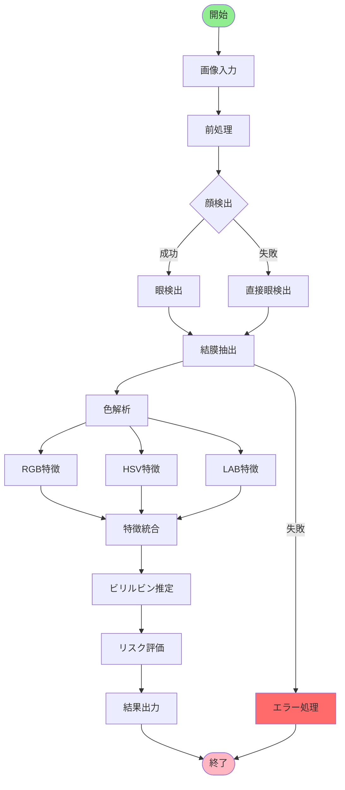
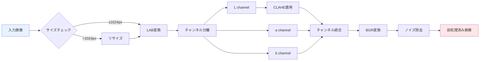
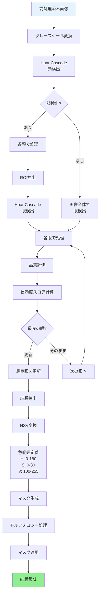
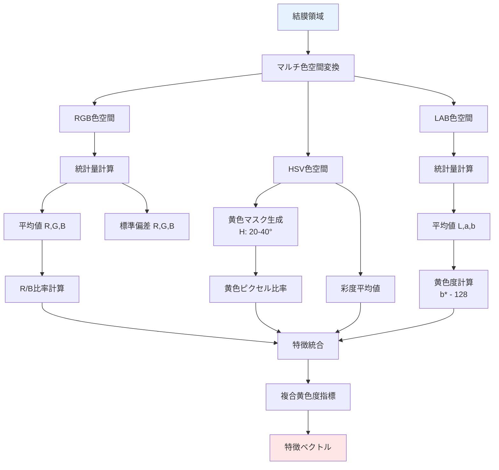
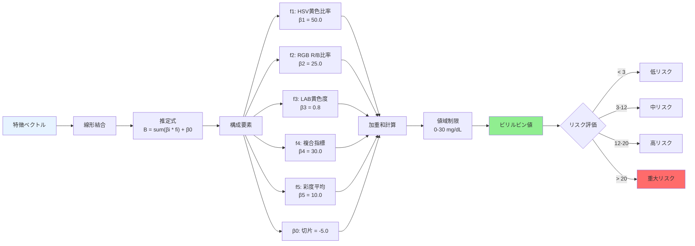
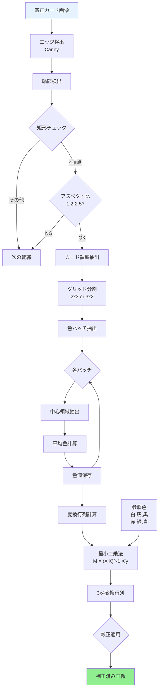
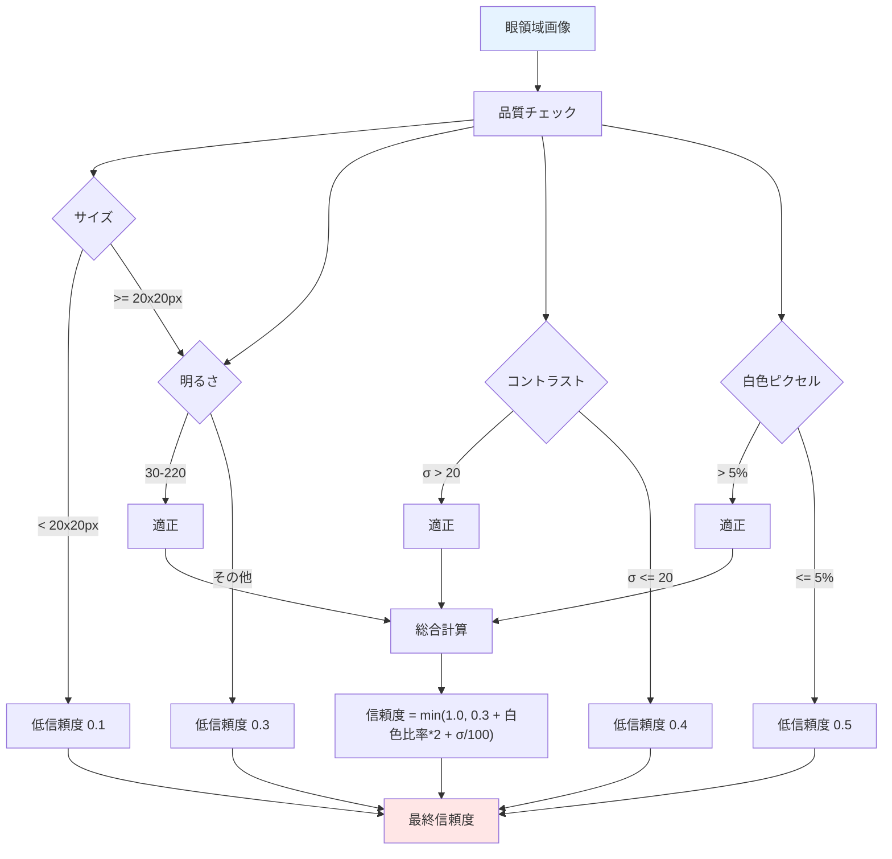
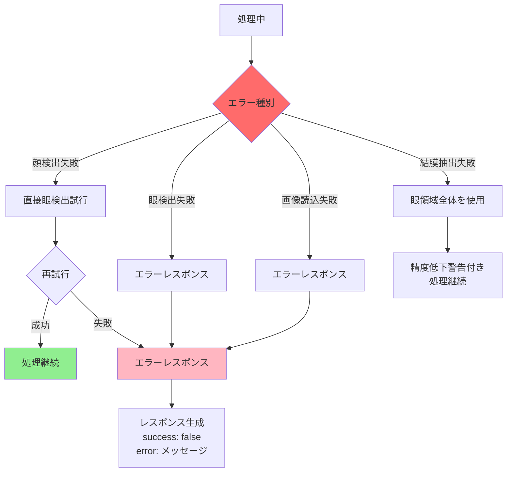

# アルゴリズムフロー図

[← README](../README.md) | [← 技術手法](methodology.md) | [APIリファレンス →](api_reference.md) | [開発ガイド →](development.md)

---

## 1. システム全体のフロー

## 2. 画像前処理の詳細フロー

## 3. 眼球・結膜検出の詳細フロー

## 4. 色特徴抽出の詳細フロー

## 5. ビリルビン推定アルゴリズム

## 6. 色較正アルゴリズム

## 7. 信頼度評価フロー

## 8. エラー処理とフォールバック

## フロー図の見方

- **四角形**: 処理ステップ
- **ひし形**: 判断・分岐
- **角丸四角形**: 開始・終了
- **色の意味**:
  - 🟦 青系: 入力データ
  - 🟥 赤系: 出力・エラー
  - 🟩 緑系: 成功・正常処理
  - ⬜ 白: 通常処理

これらのフロー図により、各アルゴリズムの詳細な処理の流れと判断基準が明確になります。