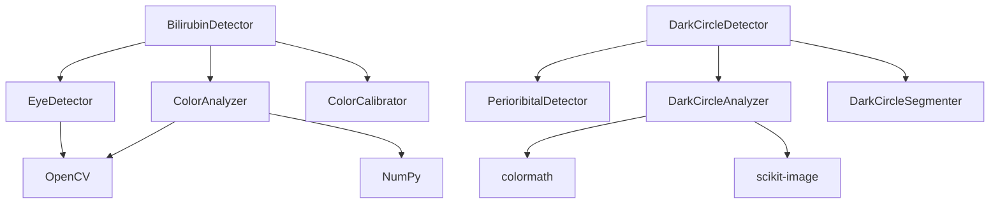

# システムアーキテクチャ / System Architecture

[← README](../README.md) | [開発ガイド →](development.md)

---

## 目次

1. [システム概要](#システム概要)
2. [アーキテクチャ設計](#アーキテクチャ設計)
3. [モジュール構成](#モジュール構成)
4. [データフロー](#データフロー)
5. [インターフェース設計](#インターフェース設計)
6. [拡張性と保守性](#拡張性と保守性)

---

## システム概要

### 設計思想

本システムは以下の原則に基づいて設計されています：

1. **モジュラー設計**: 機能ごとに独立したモジュール
2. **疎結合**: モジュール間の依存関係を最小化
3. **拡張性**: 新機能の追加が容易
4. **テスト可能性**: 各モジュールの独立したテスト

### システム構成図

```
┌─────────────────────────────────────────────────────────┐
│                    Application Layer                     │
├─────────────────────┬───────────────────────────────────┤
│  Bilirubin Detector │      Dark Circle Detector         │
├─────────────────────┴───────────────────────────────────┤
│                     Core Modules                         │
├──────────┬──────────┬──────────┬────────────────────────┤
│   Image  │  Color   │Detection │    Segmentation        │
│Processing│ Analysis │          │                        │
├──────────┴──────────┴──────────┴────────────────────────┤
│                   Utility Layer                          │
├──────────────────────────────────────────────────────────┤
│               External Libraries                         │
│  OpenCV  │  NumPy  │  SciPy  │  scikit-image │colormath│
└──────────────────────────────────────────────────────────┘
```

---

## アーキテクチャ設計

### レイヤードアーキテクチャ

#### 1. アプリケーション層

メインの検出器クラスが配置される層：

- `BilirubinDetector`: ビリルビン検出の統合インターフェース
- `DarkCircleDetector`: ダークサークル検出の統合インターフェース

```python
# 責務の分離
class BilirubinDetector:
    def __init__(self):
        self.eye_detector = EyeDetector()
        self.color_analyzer = ColorAnalyzer()
        self.calibrator = ColorCalibrator()
```

#### 2. コアモジュール層

特定の機能を提供する専門モジュール：

```
utils/
├── image_processing.py    # 画像前処理、眼球検出
├── color_analysis.py      # 色特徴抽出
├── calibration.py         # 色較正
├── periorbital_detection.py   # 眼窩周囲検出
├── dark_circle_analysis.py    # ダークサークル色解析
└── dark_circle_segmentation.py # 領域分割
```

#### 3. ユーティリティ層

共通機能とヘルパー関数

#### 4. 外部ライブラリ層

サードパーティライブラリへの依存

### 設計パターン

#### Strategy パターン

異なる検出アルゴリズムの切り替えを可能に：

```python
class DetectionStrategy(ABC):
    @abstractmethod
    def detect(self, image: np.ndarray) -> Dict:
        pass

class HaarCascadeStrategy(DetectionStrategy):
    def detect(self, image: np.ndarray) -> Dict:
        # Haar Cascade実装

class DNNStrategy(DetectionStrategy):
    def detect(self, image: np.ndarray) -> Dict:
        # DNN実装（将来）
```

#### Factory パターン

オブジェクトの生成を統一：

```python
class DetectorFactory:
    @staticmethod
    def create_detector(detector_type: str):
        if detector_type == "bilirubin":
            return BilirubinDetector()
        elif detector_type == "dark_circle":
            return DarkCircleDetector()
```

---

## モジュール構成

### コアモジュールの責務

#### image_processing.py

**責務**: 画像の前処理と基本的な検出

- 画像リサイズと正規化
- CLAHE によるコントラスト強調
- Haar Cascade による顔・眼検出
- 結膜領域の抽出

```python
class EyeDetector:
    """眼球および結膜領域の検出"""
    
    def detect_conjunctiva(self, image: np.ndarray) -> Tuple[Optional[np.ndarray], float]:
        """結膜領域を検出し、信頼度スコアと共に返す"""
```

#### color_analysis.py

**責務**: 色空間変換と特徴抽出

- RGB/HSV/LAB 色空間への変換
- 統計的特徴の計算
- 黄色度指標の算出

```python
class ColorAnalyzer:
    """色特徴の抽出と解析"""
    
    def analyze(self, image: np.ndarray) -> Dict:
        """複数の色空間から特徴を抽出"""
```

#### periorbital_detection.py

**責務**: 眼窩周囲領域の検出

- 顔領域内での眼の位置特定
- 眼窩下・頬領域の自動抽出
- 左右の眼の分離処理

#### dark_circle_analysis.py

**責務**: CIELAB色空間での高度な解析

- CIE2000 ΔE計算
- ITA（Individual Typology Angle）算出
- 赤み・青み指標の計算

### モジュール間の依存関係



---

## データフロー

### ビリルビン検出のデータフロー

```
入力画像 (BGR)
    ↓
前処理 (リサイズ、CLAHE)
    ↓
顔検出 (Haar Cascade)
    ↓
眼検出 (Haar Cascade)
    ↓
結膜抽出 (HSVマスキング)
    ↓
色特徴抽出 (RGB/HSV/LAB)
    ↓
ビリルビン推定 (線形回帰)
    ↓
結果出力 (JSON/画像)
```

### ダークサークル検出のデータフロー

```
入力画像 (BGR)
    ↓
顔検出 (Haar Cascade)
    ↓
眼窩周囲領域抽出
    ↓
色空間変換 (BGR → LAB)
    ↓
ΔE計算 (眼窩下 vs 頬)
    ↓
セグメンテーション
    ↓
重症度評価
    ↓
結果出力 (JSON/画像)
```

### データ構造

#### 検出結果のスキーマ

```python
# ビリルビン検出結果
BilirubinResult = {
    'success': bool,
    'bilirubin_level_mg_dl': float,
    'risk_level': Literal['low', 'moderate', 'high', 'critical'],
    'confidence': float,
    'color_features': Dict[str, float],
    'calibrated': bool,
    'error': Optional[str]
}

# ダークサークル検出結果
DarkCircleResult = {
    'success': bool,
    'average_delta_e': float,
    'severity': Literal['none', 'mild', 'moderate', 'severe'],
    'symmetry_score': float,
    'left_eye': EyeAnalysis,
    'right_eye': EyeAnalysis,
    'masks': Dict[str, np.ndarray],
    'error': Optional[str]
}
```

---

## インターフェース設計

### API設計原則

1. **一貫性**: すべての検出器が同じパターンに従う
2. **明確性**: メソッド名が機能を明確に表現
3. **エラーハンドリング**: 失敗時も構造化された応答

### 共通インターフェース

```python
from abc import ABC, abstractmethod

class BaseDetector(ABC):
    """すべての検出器の基底クラス"""
    
    @abstractmethod
    def detect(self, image_path: str) -> Dict:
        """検出を実行"""
        pass
    
    @abstractmethod
    def visualize_results(self, image_path: str, results: Dict, output_path: str):
        """結果を可視化"""
        pass
```

### エラーハンドリング戦略

```python
class DetectionError(Exception):
    """検出エラーの基底クラス"""
    pass

class FaceNotFoundError(DetectionError):
    """顔が検出されない場合"""
    pass

class InvalidImageError(DetectionError):
    """無効な画像形式"""
    pass
```

---

## 拡張性と保守性

### 拡張ポイント

#### 1. 新しい検出アルゴリズムの追加

```python
# 新しい検出戦略の追加
class DeepLearningStrategy(DetectionStrategy):
    def __init__(self, model_path: str):
        self.model = load_model(model_path)
    
    def detect(self, image: np.ndarray) -> Dict:
        # DNN実装
```

#### 2. 新しい色空間の追加

```python
# 色解析の拡張
def extract_xyz_features(image: np.ndarray) -> Dict:
    """XYZ色空間の特徴抽出"""
    xyz = cv2.cvtColor(image, cv2.COLOR_BGR2XYZ)
    # 特徴計算
```

#### 3. 新しい出力形式の追加

```python
# 出力フォーマッターの追加
class XMLFormatter(OutputFormatter):
    def format(self, results: Dict) -> str:
        # XML形式への変換
```

### 設定管理

#### 設定ファイル構造

```yaml
# config.yaml
detection:
  face_cascade: "haarcascade_frontalface_default.xml"
  eye_cascade: "haarcascade_eye.xml"
  min_face_size: [30, 30]
  
color_analysis:
  hsv_yellow_range: [20, 40]
  lab_reference_values:
    skin_b: 15.0
    
thresholds:
  bilirubin:
    low: 3.0
    moderate: 12.0
    high: 20.0
  dark_circle:
    mild: 3.0
    moderate: 5.0
    severe: 8.0
```

### テスト戦略

#### ユニットテスト構造

```
tests/
├── unit/
│   ├── test_image_processing.py
│   ├── test_color_analysis.py
│   └── test_dark_circle_analysis.py
├── integration/
│   ├── test_bilirubin_detector.py
│   └── test_dark_circle_detector.py
└── fixtures/
    └── test_images/
```

#### モックとスタブ

```python
# 外部依存のモック
@patch('cv2.CascadeClassifier')
def test_face_detection(mock_cascade):
    mock_cascade.return_value.detectMultiScale.return_value = [
        (100, 100, 200, 200)
    ]
    # テスト実行
```

### パフォーマンス最適化

#### キャッシング戦略

```python
from functools import lru_cache

class OptimizedDetector:
    @lru_cache(maxsize=128)
    def _load_cascade(self, cascade_path: str):
        """カスケード分類器のキャッシング"""
        return cv2.CascadeClassifier(cascade_path)
```

#### 並列処理

```python
from concurrent.futures import ThreadPoolExecutor

def process_batch(image_paths: List[str]):
    with ThreadPoolExecutor(max_workers=4) as executor:
        results = executor.map(detect_single, image_paths)
    return list(results)
```

---

## 今後の拡張計画

### 短期的な改善

1. **エラーハンドリングの強化**
   - より詳細なエラーメッセージ
   - リトライ機構の実装

2. **設定の外部化**
   - YAML/JSONベースの設定ファイル
   - 環境変数のサポート

### 中期的な拡張

1. **REST API化**
   - FastAPIによるWeb API実装
   - 非同期処理のサポート

2. **プラグインシステム**
   - カスタム検出アルゴリズムのプラグイン化
   - 動的ロード機能

### 長期的なビジョン

1. **クラウド対応**
   - AWS/GCP/Azureへのデプロイ
   - スケーラブルなアーキテクチャ

2. **エッジコンピューティング**
   - モバイルデバイスでの実行
   - リアルタイム処理の最適化