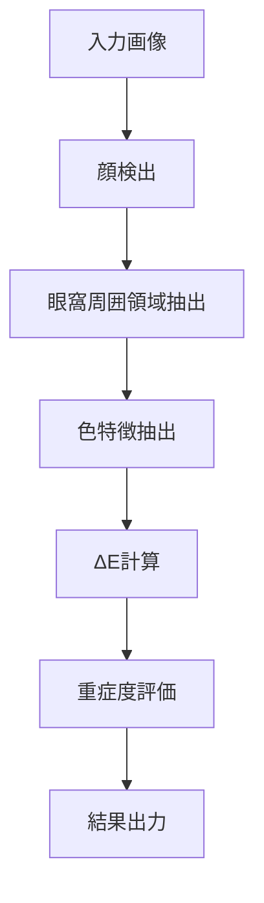

# ダークサークル検出の技術手法 / Dark Circle Detection Methodology

[← README](../README.md) | [APIリファレンス →](api_reference.md) | [アルゴリズムフロー →](algorithm_flowchart.md)

---

## 目次

1. [概要](#概要)
2. [科学的背景](#科学的背景)
3. [検出アルゴリズム](#検出アルゴリズム)
4. [色空間解析](#色空間解析)
5. [重症度評価](#重症度評価)
6. [実装の詳細](#実装の詳細)
7. [性能と限界](#性能と限界)

---

## 概要

### ダークサークルとは

ダークサークル（眼窩周囲色素沈着）は、目の下の皮膚が暗く見える状態で、以下の要因により発生します：

1. **色素沈着型**: メラニンの過剰生成
2. **血管型**: 薄い皮膚を通して血管が透けて見える
3. **構造型**: 皮膚のたるみによる影
4. **混合型**: 複数の要因の組み合わせ

### 検出の課題

- 肌色による個人差が大きい
- 照明条件の影響を受けやすい
- 主観的な評価基準
- 複数の原因が混在する場合がある

---

## 科学的背景

### 色彩科学的アプローチ

本システムは、CIELAB色空間とCIE2000色差式（ΔE）を使用して、客観的な評価を実現します。

#### CIELAB色空間の利点

1. **知覚的均等性**: 色の違いが数値的な距離に比例
2. **明度独立性**: L*（明度）とa*b*（色度）が独立
3. **国際標準**: CIE（国際照明委員会）による標準化

#### CIE2000 ΔE（色差）

```
ΔE = √[(ΔL'/kL·SL)² + (ΔC'/kC·SC)² + (ΔH'/kH·SH)² + RT·(ΔC'/kC·SC)·(ΔH'/kH·SH)]
```

- **ΔE < 1.0**: 人間の目では区別できない
- **ΔE 1.0-3.0**: わずかに認識可能
- **ΔE 3.0-5.0**: 明確に認識可能  
- **ΔE > 5.0**: 大きな色差

### Individual Typology Angle (ITA)

肌色を客観的に分類するための指標：

```
ITA = arctan((L* - 50) / b*) × 180 / π
```

- 肌色に依存しない評価が可能
- 人種や個人差を考慮した解析

---

## 検出アルゴリズム

### 全体フロー



### 1. 眼窩周囲領域の検出

#### Haar Cascade による顔・眼検出

```python
# 顔検出
face_cascade = cv2.CascadeClassifier(
    cv2.data.haarcascades + 'haarcascade_frontalface_default.xml'
)
faces = face_cascade.detectMultiScale(gray, 1.3, 5)

# 眼検出
eye_cascade = cv2.CascadeClassifier(
    cv2.data.haarcascades + 'haarcascade_eye.xml'
)
eyes = eye_cascade.detectMultiScale(face_roi)
```

#### 領域の自動抽出

1. **眼窩下領域（Infraorbital）**: 眼の下30%の高さ
2. **頬参照領域（Cheek）**: 眼窩下領域のさらに下20%
3. **横方向拡張**: 眼の幅の20%を左右に拡張

### 2. 色解析プロセス

#### BGR → LAB 変換

```python
# OpenCVのBGRからRGBへ変換
region_rgb = cv2.cvtColor(region, cv2.COLOR_BGR2RGB)

# 正規化
region_normalized = region_rgb.astype(np.float32) / 255.0

# LAB色空間へ変換
region_lab = skcolor.rgb2lab(region_normalized)
```

#### 平均色値の計算

各領域の平均L*a*b*値を算出し、代表色とします。

### 3. ΔE計算

眼窩下領域と頬領域の色差を計算：

```python
def calculate_delta_e(self, region1: np.ndarray, region2: np.ndarray) -> float:
    lab1 = self.get_mean_lab(region1)
    lab2 = self.get_mean_lab(region2)
    
    color1 = LabColor(lab1[0], lab1[1], lab1[2])
    color2 = LabColor(lab2[0], lab2[1], lab2[2])
    
    return delta_e_cie2000(color1, color2)
```

---

## 色空間解析

### LAB色空間での特徴

#### L*（明度）解析
- **範囲**: 0（黒）～ 100（白）
- **ダークサークル**: L*値が低い（暗い）

#### a*（赤-緑軸）解析
- **正の値**: 赤み（血管性ダークサークル）
- **負の値**: 緑み（通常は皮膚には見られない）

#### b*（黄-青軸）解析  
- **正の値**: 黄み（健康な肌色）
- **負の値**: 青み（静脈うっ血）

### 追加指標

#### 暗さ比率（Darkness Ratio）

```python
darkness_ratio = 1.0 - (L_infraorbital / L_cheek)
```

#### 赤み指標（Redness Index）

```python
redness_index = max(0, a*) / 20.0  # 正規化
```

#### 青み指標（Blueness Index）

```python
reference_b = 15.0  # 健康な肌のb*値
blueness_index = max(0, reference_b - b*) / reference_b
```

---

## 重症度評価

### ΔEベースの分類

| 重症度 | ΔE範囲 | 臨床的意義 |
|--------|--------|-----------|
| なし（None） | < 3.0 | ほとんど目立たない |
| 軽度（Mild） | 3.0-5.0 | わずかに目立つ |
| 中等度（Moderate） | 5.0-8.0 | 明らかに目立つ |
| 重度（Severe） | > 8.0 | 非常に目立つ |

### 左右対称性評価

```python
def calculate_symmetry(left_delta_e, right_delta_e):
    delta_e_diff = abs(left_delta_e - right_delta_e)
    symmetry = 1.0 - min(delta_e_diff / 10.0, 1.0)
    return symmetry
```

- 1.0 = 完全に対称
- 0.0 = 大きな非対称性

---

## 実装の詳細

### セグメンテーション手法

#### 適応的閾値処理

ΔE値に基づいて動的に閾値を調整：

```python
def calculate_adaptive_threshold(delta_e):
    if delta_e <= 3:
        return 0.3
    elif delta_e >= 8:
        return 0.7
    else:
        return 0.3 + (delta_e - 3) * 0.08
```

#### モルフォロジー処理

1. **クロージング**: 小さな穴を埋める
2. **オープニング**: ノイズを除去
3. **穴埋め**: 内部の穴を埋める

### エラーハンドリング

```python
# 空の領域チェック
if eye_region.size == 0:
    eye_region = np.zeros((10, 10, 3), dtype=np.uint8)

# 領域サイズ検証
if area < min_area or area > max_area:
    # 適切なサイズの領域のみを使用
```

---

## 性能と限界

### 性能指標

#### 処理速度
- 顔検出: ~200ms
- 色解析: ~50ms  
- 全体処理: ~300-500ms/画像

#### 精度
- 研究文献での報告: ΔE相関係数 0.7-0.85
- 本実装: 評価データ未取得（プロトタイプ）

### 技術的限界

1. **照明依存性**
   - 一定の照明条件が必要
   - 極端な影や反射に弱い

2. **個人差**
   - 肌色による影響（ITAで部分的に補正）
   - 年齢・性別による差異は未考慮

3. **原因の特定**
   - 色素沈着型と血管型の区別は限定的
   - 構造型（影）の検出は困難

### 改善の方向性

1. **深層学習の導入**
   - U-Netによる精密なセグメンテーション
   - 転移学習による精度向上

2. **マルチスペクトル解析**
   - メラニン・ヘモグロビン指標の直接測定
   - 原因別の定量化

3. **3D形状解析**
   - 構造型ダークサークルの検出
   - 深度情報の活用

---

## 参考文献

1. Periorbital hyperpigmentation: A comprehensive review. *J Eur Acad Dermatol Venereol.* 2016;30(3):374-81.

2. Objective assessment of periorbital hyperpigmentation using diffuse reflectance spectroscopy. *Skin Res Technol.* 2021;27(3):385-391.

3. Automated detection and quantification of dark circles using image processing. *IEEE EMBS.* 2019:1245-1248.

4. The CIE 2000 color-difference formula: Implementation notes. *Color Res Appl.* 2005;30(1):21-30.

---

## 関連ドキュメント

- [APIリファレンス](api_reference.md) - 実装の詳細
- [使用例](examples.md) - 実践的なコード例
- [アルゴリズムフロー図](algorithm_flowchart.md) - 視覚的な説明